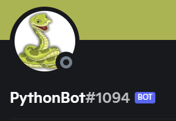

# MindfulHacks Discord Bot
[](https://youtu.be/CtlxeyeFFSQ "Demonstration. You will be redirected to YouTube")

## Message from the devs
Just a quick note, our [YouTube video](https://youtu.be/MqmW8C2NsnQ) is called **MindfulHacks Discord Bot demonstration**, but I removed it due to the poor video quality and was planning to reupload it. Here is our [submission](https://devpost.com/software/discord-python-bot-0g14qa), which due to technical difficulties is incomplete.

## Quick Start guide
### Prerequisites:
- Have a Discord account
- Have administrative priviledges on the server that you are on
### Guide
Click this [link](https://discord.com/oauth2/authorize?client_id=883604218915725312&permissions=257698495552&scope=bot) to get started

## The instructions below are to host the bot
### Prerequisites: 
- python
- A [computer](https://www.aftershockpc.com/) or [server](https://aws.amazon.com/free/) that runs 24/7, prefably Linux

### Build
Download the source code using git or through this website.

The following commands are needed so that python can successfully import the libraries:
```bash
$ pip install google-api-python-client
$ pip install google-api-core
$ pip install discord.py
```

### Installation
1. After activating the developer portal for your discord account, navigate your way to the application page. 
2. Click on the **new application** button.
3. Add the bot under the **Bot** tab.
4. On the same bot tab, click to reveal `secret_token` and copy it.
5. Go to the last line of `main.py` and fill in `client.run('secret_token')`

A helpful [guide](https://www.howtogeek.com/364225/how-to-make-your-own-discord-bot) if the instructions above are unclear

### How to use
After running the program, users will need to just start typing his/her feeling to the discord channel. As long as the word contains a negative feeling(as long as the negative.txt file contains the feeling. Update to increase the number of feelings), the bot shall return youtube links for music/videos that are related to the feeling.

Navigate to the folder containing `main.py` using `cd`. 
```bash
$ Python main.py &         # to run in background
```
